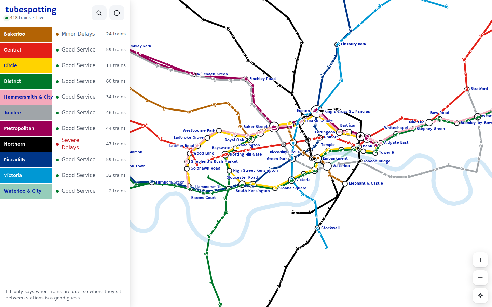

<h1 align="center">tubespotting</h1>
<p align="center">
<i>Every London Underground train on one live map</i>
<br />
<b>🌐 <a href="https://tubespotting.peng.ly/">tubespotting.peng.ly</a></b><br />
</p>

<p align="center">
  <a href="https://tubespotting.peng.ly/"></a>
</p>

<details>
  <summary>Contents</summary>

- [About](#about)
- [Usage](#usage)
- [Deployment](#deployment)
- [Configuration](#configuration)
- [Development](#development)
- [Credits](#credits)

</details>

## About

A live map of the Tube. Every train on all eleven Underground lines, moving in real-time between stations as TfL reports them.

---

## Usage

Just open [tubespotting.peng.ly](https://tubespotting.peng.ly/) and drag/ pinch around.

- Tap a line on the status board to pick it out and see every train on it
- Tap a station for its next trains, platform by platform, on a countdown board
- Tap a train to see where it's off to and follow it across London
- Search (or just press `/`) finds any station or line
- The locate button opens your nearest station. Your location never leaves your device
- Additional lines like the Elizabeth line and Overground can be added to the map from the line list
- The map button switches between the real geography and a tube map laid out like TfL's own
- You can append a station or line to the URL to share a link, e.g. `?line=victoria` or `?station=940GZZLUOXC`

---

## Deployment

### Option 1: Cloudflare

It ships with `@sveltejs/adapter-cloudflare` and a `wrangler.jsonc`. Point the route at your own hostname, set `CLOUDFLARE_API_TOKEN` and `CLOUDFLARE_ACCOUNT_ID`, then:

```shell
ADAPTER=cloudflare npm run build && npx wrangler deploy
```

The free plan's CPU limit is too tight for reading the whole network every few seconds, so you'll want Workers Paid.

### Option 2: Docker

There's a multi-arch image on DockerHub ([`notaflightrisk/tubespotting`](https://hub.docker.com/r/notaflightrisk/tubespotting)) and GHCR ([`ghcr.io/notaflightrisk/tubespotting`](https://github.com/NotAFlightRisk/tubespotting/pkgs/container/tubespotting)):

```shell
docker run -p 3000:3000 notaflightrisk/tubespotting
```

### Option 3: From a release

Each [release](https://github.com/NotAFlightRisk/tubespotting/releases) has a `site.zip` with the built Node server in it. Unzip it and run `node build` (Node 22 or newer).

### Option 4: Build from source

Follow the [Development](#development) steps, then `npm run build` and `npm start`.

---

## Configuration

No config is needed, but adding a TFL_API_KEY is reccomended to raise the rate-limits.

<details>
<summary>Optional environmental variables</summary>

| Variable                  | What it does                                                                                                           |
| ------------------------- | ---------------------------------------------------------------------------------------------------------------------- |
| `TFL_APP_KEY`             | A free [TfL API key](https://api-portal.tfl.gov.uk/), which raises the rate limit. Without one TfL's asked anonymously |
| `PORT`                    | Port for the Node server and Docker image, `3000` by default                                                           |
| `PUBLIC_PLAUSIBLE_SCRIPT` | Build time. A Plausible script URL to count visits, off when empty                                                     |
| `PUBLIC_SENTRY_DSN`       | Build time. A Sentry or Bugsink DSN for error reports, off when empty                                                  |

</details>

---

## Development

You'll need [Node](https://nodejs.org/) 22 or newer, plus [Git](https://git-scm.com/).

```bash
git clone git@github.com:NotAFlightRisk/tubespotting.git
cd tubespotting
npm install
npm run dev
```

The dev server is then on [localhost:5173](http://localhost:5173).<br>
The other scripts you'll want are `npm run check` (types), `npm test` (tests) and `npm run format`.

The stations, routes and run times live in `src/lib/data/network.json`, along with each track's real shape from OpenStreetMap and the tube map layout. That follows TfL's own map, with its stations placed by hand in `scripts/tube-map.mjs` and the track between them routed by `scripts/schematic.mjs`. When TfL changes the network, rebuild it with `npm run network` (put your `TFL_APP_KEY` in the environment first, it makes about 100 calls). After editing just the tube map, `npm run network -- --tube-map` lays it out again without calling TfL.

Alternatively, build the container with `docker build -t tubespotting .`

---

## Credits

Powered by TfL Open Data. Contains OS data © Crown copyright and database rights 2016 and Geomni UK Map data © and database rights [2019]. Track shapes and the Thames are © [OpenStreetMap](https://www.openstreetmap.org/copyright) contributors. Not affiliated with TfL.

##### Contributors

[](https://github.com/NotAFlightRisk/tubespotting/graphs/contributors)

---

<!-- License + Copyright -->
<p  align="center">
  <a href="https://github.com/NotAFlightRisk"></a><br>
  <sup>
    <i>Licensed under <a href="../LICENSE">MIT</a>, © <a href="https://peng.ly">NotAFlightRisk</a> 2026</i>
  </sup>
</p>

<!--
oooh, hello there! hope you're having a nice day :)
   |\__      |\___
 (:> __)X  (:o ___(
   |/        |/
-->
